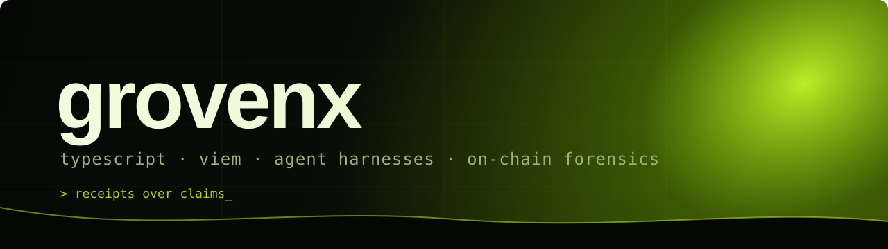

<div align="center">



<br/>

<a href="https://x.com/grovenx"></a>


</div>

##  About me

```ts
const grovenx = {
  writes:  ["Claude Code", "Grok", "agent harnesses"],   // on X, @grovenx
  builds:  ["sniper terminals", "on-chain forensics", "loops that run overnight"],
  rules:   ["receipts over claims", "local first", "the chain is the source"],
  now:     "launch snipers + on-chain analytics that read every launch in one call",
  learns:  "by shipping, then reading what the chain actually said",
};
```

##  Stack

<p>
  
  
  
  
  
</p>
<p>
  
  
  
  
  
</p>

##  What I work on

| Area | What it means in practice |
| :--- | :--- |
| 🎯 **Launch sniping** | Terminals that read every launch on a chain in one call, score it with rules you can read, and enter only when the numbers say so |
| ⛓️ **On-chain forensics** | Who gets paid on a token, how much a deployer sold, which wallets were exempted from a launch tax — from logs and calldata, never from an API |
| 🤖 **Agent harnesses** | Claude Code and Grok loops that run overnight inside written rules and leave a dated receipt |
| 🎬 **Content pipelines** | Video, subtitles, covers and renders for X — scripted end to end |

> Nothing here is a black box. If a number is on screen, the tool can show the block it came from.

## 🏹 Now shipping

- **launch sniper** — read → score → enter, all inside rules you can audit
- **on-chain forensics kit** — tax, exemptions and deployer sells straight from logs

##  Official wallets

> Building a token off my posts or content and want to allocate fees, team tokens or airdrops? Use the addresses below. **This is the only official set — verify before binding it to any contract or pump.fun setup.**

```text
SOL       9M5AB3E2oiFoNPivm2r7wsUSrC3JuoXu3tqNX8UZM8S
Robinhood 0x8e40401d502a7fe4cf65f86323e87194f3ef928c
```

<div align="center">
<br/>
<br/>
<sub><code>local first · the chain is the source · receipts over claims</code></sub>
</div>
